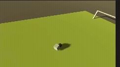

# Godot RL Soccer Agent
 
Training a reinforcement learning agent to play soccer using [Godot RL Agents](https://github.com/edbeeching/godot_rl_agents) (Godot 4, GDScript) with Stable Baselines3 (PPO).
 
## Objective
 
Get the model to score toward the goal. To achieve that, the agent receives:
- A small reward every time it gets closer to the ball
- A small reward for kicking the ball
- A small reward for getting the ball closer to the goal
- A massive reward for actually scoring
---
 
## Devlog
 
### Day 1
 
**Technical gotchas**
- Continuous actions are always `[-1, 1]`, never unbounded. Any action representing a real-world quantity (position, speed, force) must be explicitly rescaled from `[-1, 1]` into actual units. This was the single biggest bug of the day — cost hours of reward-shaping debugging.
- **Godot gotcha:** `CharacterBody3D` + `RigidBody3D` don't reliably trigger `body_entered`, even when physical blocking works. Contact needs to be detected from the `CharacterBody3D` side via `get_slide_collision()` after `move_and_slide()` instead.
**RL / reward-design lessons**
- Any reward that fires repeatedly without a debounce is farmable. Distance-per-frame, contact-without-cooldown — pretty much anything checked every physics frame needs an explicit "has this already been counted" guard, or the policy will find an exploit. For example, touching the ball triggered a reward for multiple frames, so the model farmed touching the ball instead of doing anything with it.
- A penalty larger than the nearby positive rewards makes avoidance the rational choice. Rule of thumb: keep negative rewards near an engagement zone smaller than the positive rewards for engaging, especially early on.
- Sparse-only rewards (goal-only) are very hard to learn from. Dense shaping (distance deltas) is what makes early learning possible at all — otherwise the model doesn't know what to do at the beginning.
### Day 2
- Added a controllable speed action. It introduced persistent inconsistency (avoidance, wild kicks, boundary running) that 2M steps didn't resolve. Ultimately removed it.
- The model can score a goal with approximately **75% accuracy**.
### Days 3–5
*Condensed together — little progress was made.*
- Added a raycast so the model can detect obstacles (the only obstacle being the goalposts next to the net).
- The model does not try to score, and seems to purposefully avoid it despite the reward incentive.
---
 
## Current Model
 
### Rewards
| Event | Reward |
|---|---|
| Kick the ball | +1.0 |
| Distance to ball (closer / farther) | small +/- |
| Kicking ball out of bounds | 0.0 |
| Player out of bounds | 0.0 |
| Scoring a goal | +100.0 |
 
### Observations
- Own global position
- Ball global position
- Goalpost position
- Vector between ball and goalpost
- Binary obstacle flag (1.0 = obstacle seen, 0.0 = clear)
### Action Space
- **Target location** — where the agent moves to
- **Kick direction** — direction the ball is struck
- **Kick strength** — how hard the ball is kicked
---
 
## Progress Video
 

 
